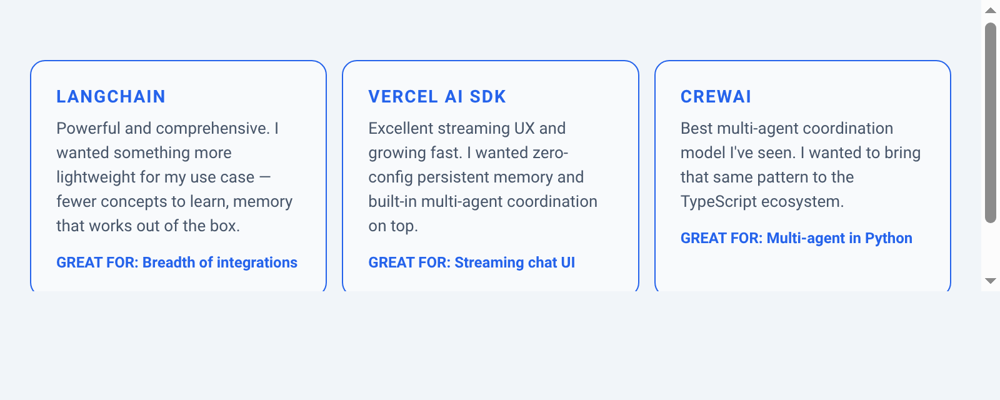
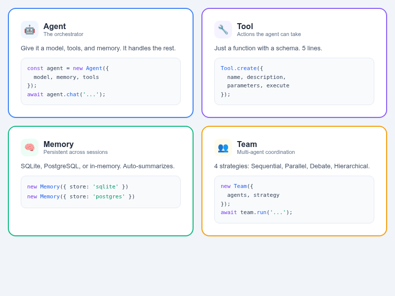
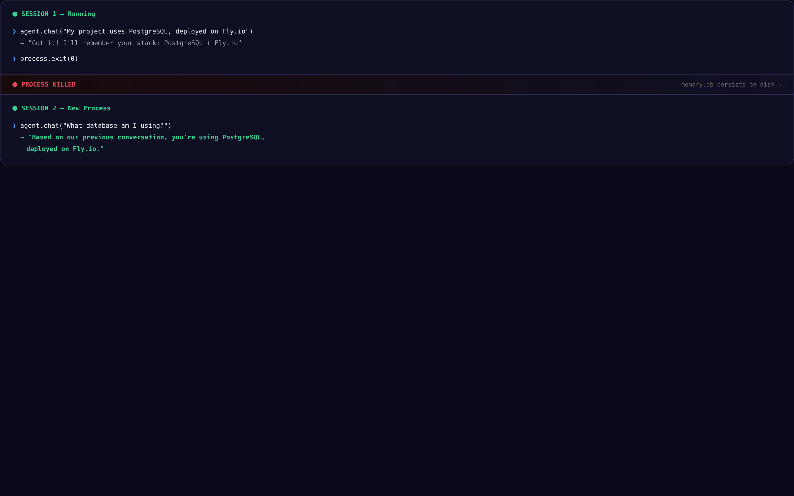
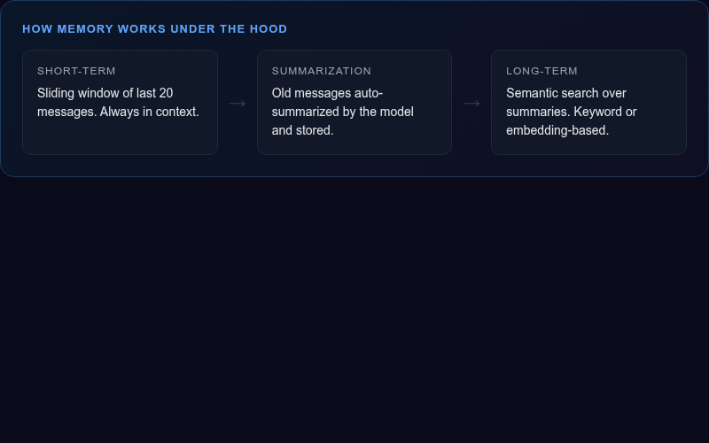
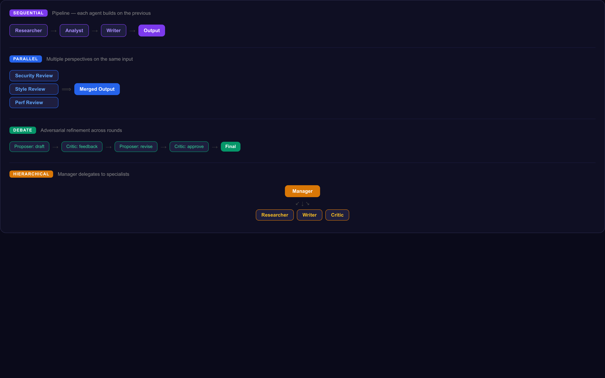
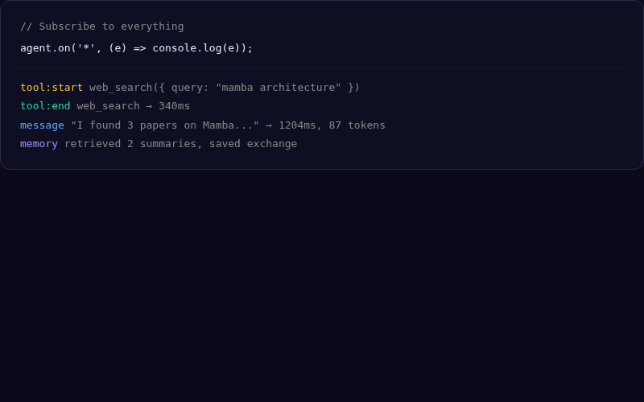
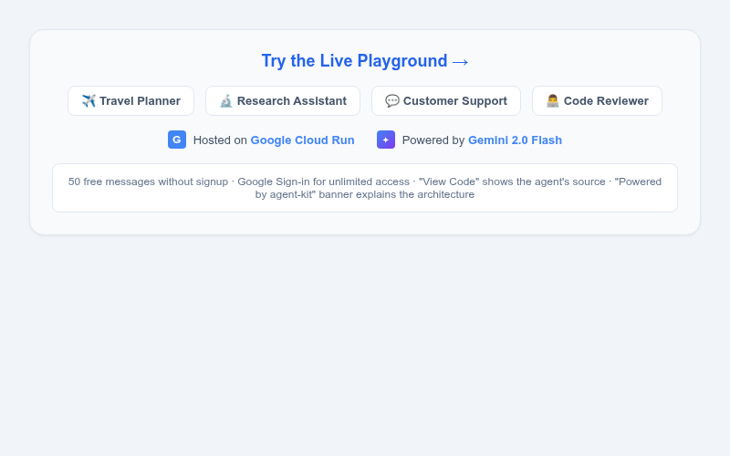
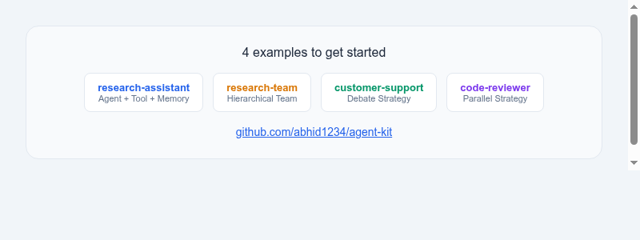

# agent-kit

[](https://github.com/abhid1234/agent-kit/actions/workflows/ci.yml)
[](https://www.npmjs.com/package/@avee1234/agent-kit)
[](LICENSE)

TypeScript-first library for building stateful, persistent AI agents.

**[Live Playground](https://www.abhi-agent-kit.space)** | **[Blog Post](https://abhid.substack.com/p/i-built-an-open-source-ai-agent-framework)** | **[npm](https://www.npmjs.com/package/@avee1234/agent-kit)** | **[Docs](https://abhid1234.github.io/agent-kit/)**

---

## Why agent-kit?

<p align="center">
  
</p>

- **Persistent memory across sessions** — SQLite or PostgreSQL. Restart your process; the agent still remembers.
- **Simple tool system** — define a tool in 5 lines with `Tool.create`. No decorators, no class inheritance.
- **Multi-agent coordination** — 4 strategies: Sequential, Parallel, Debate, Hierarchical.
- **Built-in observability** — subscribe to `tool:start`, `tool:end`, `memory:save` events. No paid add-on.
- **TypeScript-first** — strict types throughout. Your editor autocompletes everything.

---

## 4 Core Concepts

<p align="center">
  
</p>

---

## Installation

```bash
npm install @avee1234/agent-kit
```

Or scaffold a new project:

```bash
npx @avee1234/agent-kit init my-agent
```

---

## Quick Start

```typescript
import { Agent, Tool, Memory } from '@avee1234/agent-kit';

const searchTool = Tool.create({
  name: 'web_search',
  description: 'Search the web',
  parameters: { query: { type: 'string' } },
  execute: async ({ query }) => fetch(`https://api.search.com?q=${query}`).then(r => r.json()),
});

const agent = new Agent({
  name: 'research-assistant',
  model: { provider: 'ollama', model: 'llama3' },
  memory: new Memory({ store: 'sqlite' }),
  tools: [searchTool],
  system: 'You are a research assistant.',
});

const response = await agent.chat('Find recent papers on transformers');
```

No model config required — ships with a built-in `MockAdapter` for development and testing without API keys.

---

## The "Wow Moment": Memory That Survives Restarts

<p align="center">
  
</p>

Kill the process, restart it, same SQLite file — the agent picks up where it left off.

<p align="center">
  
</p>

---

## Multi-Agent Coordination

<p align="center">
  
</p>

```typescript
const team = new Team({
  agents: [researcher, writer, critic],
  strategy: 'debate',
  maxRounds: 3,
});
const result = await team.run('What is the best database for embeddings?');
```

---

## Built-In Observability

<p align="center">
  
</p>

```typescript
agent.on('*', (e) => console.log(e.type, e.data, e.latencyMs));
```

No LangSmith, no third-party service. Just `EventEmitter` — pipe it to whatever you use.

---

## Model Configuration

```typescript
// Mock (zero config, built-in — great for testing)
const agent = new Agent({ name: 'test' });

// Ollama (local models)
const agent = new Agent({ name: 'local', model: { provider: 'ollama', model: 'llama3' } });

// Google AI Studio (Gemini)
const agent = new Agent({
  name: 'gemini',
  model: new OpenAICompatibleAdapter({
    baseURL: 'https://generativelanguage.googleapis.com/v1beta/openai',
    model: 'gemini-2.0-flash',
    apiKey: process.env.GOOGLE_AI_API_KEY,
  }),
});

// Any OpenAI-compatible endpoint (Together, OpenRouter, Groq, etc.)
const agent = new Agent({
  name: 'agent',
  model: new OpenAICompatibleAdapter({ baseURL: '...', model: '...', apiKey: '...' }),
});
```

---

## Try It Live

<p align="center">
  
</p>

**[www.abhi-agent-kit.space](https://www.abhi-agent-kit.space)**

4 pre-built agents with real-time tool execution, persistent memory, and live event streaming. Powered by Gemini 2.0 Flash on Google Cloud Run.

---

## What You Can Build

<p align="center">
  
</p>

- **Travel planner** — destination search + weather + flight/hotel booking + budget calculator
- **Research assistant** — web search + note-taking + session memory
- **Customer support** — order lookup + conversation history
- **Code reviewer** — security analysis + style checking
- **Data analyst** — SQL queries + chart generation + persistent findings
- **Personal assistant** — calendar + email + long-term preferences

---

## Read More

- **[Blog Post](https://abhid.substack.com/p/i-built-an-open-source-ai-agent-framework)** — the full story of why and how I built agent-kit
- **[Documentation](https://abhid1234.github.io/agent-kit/)** — API reference, guides, and examples
- **[npm](https://www.npmjs.com/package/@avee1234/agent-kit)** — `npm install @avee1234/agent-kit`

## Contributing

Bug reports and pull requests welcome. Open an issue to discuss changes before submitting a PR.

## License

MIT
