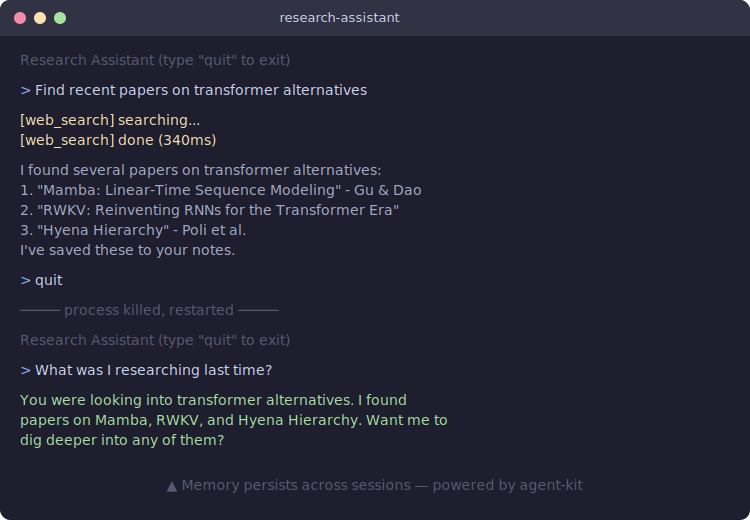

# agent-kit

TypeScript-first library for building stateful, persistent AI agents.

<p align="center">
  
</p>

## Why agent-kit?

- **Persistent memory across sessions** — SQLite store keeps conversation history and auto-summarizes old exchanges. Restart your process; the agent still remembers.
- **Simple tool system** — define a tool in five lines with `Tool.create`. No decorator magic, no class inheritance.
- **Built-in observability** — subscribe to `message`, `tool:start`, `tool:end`, and `error` events. No paid add-on required.
- **TypeScript-first with great types** — strict types throughout. Your editor autocompletes `AgentConfig`, `ToolDefinition`, `AgentEvent`, and everything else.

## Installation

```bash
npm install @avee1234/agent-kit
```

## Quick Start

```typescript
import { Agent, Tool, Memory } from '@avee1234/agent-kit';

const echo = Tool.create({
  name: 'echo',
  description: 'Echo a message back',
  parameters: { message: { type: 'string', description: 'Text to echo' } },
  execute: async ({ message }) => String(message),
});

const agent = new Agent({
  name: 'my-agent',
  memory: new Memory({ store: 'sqlite' }),
  tools: [echo],
  system: 'You are a helpful assistant.',
});

const response = await agent.chat('Say hello');
console.log(response.content);
```

No model config required — `Agent` ships with a built-in `MockAdapter` so you can develop and test without any API keys.

## Research Assistant Demo

The `examples/research-assistant` directory contains a full CLI agent that searches the web, saves notes, and remembers research across sessions.

```bash
cd examples/research-assistant
npm install
npm start
```

Then chat with it:

```
> Find recent papers on transformer alternatives
> What did I research last time?
> Save a note about Mamba architecture
```

Kill the process and restart — memory persists in `research.db`.

## Core Concepts

### Agent

The main class. Runs a tool-calling loop, manages memory context, and emits observability events.

```typescript
import { Agent } from '@avee1234/agent-kit';

const agent = new Agent({
  name: 'assistant',
  model: { provider: 'ollama', model: 'llama3' },
  memory: new Memory({ store: 'sqlite' }),
  tools: [myTool],
  system: 'You are a helpful assistant.',
  maxToolRounds: 10,
});
```

| Option | Type | Default | Description |
|---|---|---|---|
| `name` | `string` | required | Unique identifier for this agent |
| `model` | `ModelAdapter \| ModelConfig` | `MockAdapter` | Model to use for completions |
| `memory` | `Memory` | none | Memory instance for persistence |
| `tools` | `Tool[]` | `[]` | Tools the agent can call |
| `system` | `string` | none | System prompt |
| `maxToolRounds` | `number` | `10` | Max consecutive tool call rounds |

**Methods:**

- `agent.chat(input: string): Promise<ModelResponse>` — send a message, get a response
- `agent.stream(input: string): AsyncIterable<ModelChunk>` — stream the response
- `agent.on(type, handler)` / `agent.off(type, handler)` — subscribe to events

### Tool

Wraps a function so the agent can call it.

```typescript
import { Tool } from '@avee1234/agent-kit';

const getWeather = Tool.create({
  name: 'get_weather',
  description: 'Get current weather for a city',
  parameters: {
    city: { type: 'string', description: 'City name', required: true },
    units: { type: 'string', enum: ['celsius', 'fahrenheit'] },
  },
  execute: async ({ city, units }) => {
    const u = units ?? 'celsius';
    const res = await fetch(`https://wttr.in/${city}?format=j1`);
    return res.json();
  },
});
```

| Field | Type | Description |
|---|---|---|
| `name` | `string` | Tool name (used by the model) |
| `description` | `string` | What the tool does |
| `parameters` | `Record<string, ParameterDef>` | JSON Schema-style parameter definitions |
| `execute` | `(params) => Promise<unknown>` | The function to run |

`ParameterDef` fields: `type`, `description`, `enum`, `required`.

### Memory

Manages conversation persistence and context retrieval.

```typescript
import { Memory } from '@avee1234/agent-kit';

// In-memory (default, testing)
new Memory()
new Memory({ store: 'memory' })

// SQLite (persists across restarts)
new Memory({ store: 'sqlite' })
new Memory({ store: 'sqlite', path: './myagent.db' })

// Custom store
new Memory({ store: myCustomStore })
```

| Option | Type | Default | Description |
|---|---|---|---|
| `store` | `'memory' \| 'sqlite' \| MemoryStore` | `'memory'` | Storage backend |
| `path` | `string` | `./agent-memory.db` | SQLite file path (sqlite only) |
| `windowSize` | `number` | `20` | Number of recent messages to include in context |
| `summarizeAfter` | `number` | `20` | Summarize after this many new messages |

Auto-summarization: when `summarizeAfter` messages accumulate, the agent summarizes them and stores the summary. Older context is retrieved via `searchSummaries`.

### Team (Multi-Agent Coordination)

Coordinate multiple agents on a single task using four strategies.

**Sequential** — agents run in order, each getting the previous agent's output:

```typescript
import { Agent, Team } from '@avee1234/agent-kit';

const team = new Team({
  agents: [researcher, writer],
  strategy: 'sequential',
});
const result = await team.run('Research AI frameworks and write a summary');
// writer receives researcher's output as context
```

**Parallel** — all agents run concurrently, results merged:

```typescript
const team = new Team({
  agents: [researcher, writer, critic],
  strategy: 'parallel',
});
const result = await team.run('Analyze this codebase');
// result.responses has each agent's individual output
```

**Debate** — agents take turns critiquing and refining:

```typescript
const team = new Team({
  agents: [proposer, critic],
  strategy: 'debate',
  maxRounds: 3,
});
const result = await team.run('What is the best database for embeddings?');
// 3 rounds of back-and-forth, then final answer
```

**Hierarchical** — a manager delegates tasks to specialists:

```typescript
const team = new Team({
  agents: [researcher, writer, critic],
  strategy: 'hierarchical',
  manager: new Agent({ name: 'manager', system: 'You coordinate a team of specialists.' }),
});
const result = await team.run('Write a blog post about transformer alternatives');
// manager decides who does what and when
```

| Option | Type | Default | Description |
|--------|------|---------|-------------|
| `agents` | `Agent[]` | — | The agents to coordinate |
| `strategy` | `string` | — | `'sequential'`, `'parallel'`, `'debate'`, or `'hierarchical'` |
| `manager` | `Agent` | — | Required for hierarchical strategy |
| `maxRounds` | `number` | `3` | Number of debate rounds |
| `maxDelegations` | `number` | `10` | Max delegations for hierarchical |

## Model Configuration

### Mock (zero config, built-in)

If you omit `model`, the agent uses `MockAdapter` — it echoes inputs and simulates tool calls. Useful for testing.

```typescript
import { MockAdapter } from '@avee1234/agent-kit';

const agent = new Agent({ name: 'test', model: new MockAdapter() });
```

### Ollama (local models)

```typescript
const agent = new Agent({
  name: 'local-agent',
  model: { provider: 'ollama', model: 'llama3' },
  // baseURL defaults to http://localhost:11434/v1
});
```

### OpenAI-compatible endpoints

Works with Together AI, OpenRouter, Anyscale, LM Studio, and any other OpenAI-compatible API.

```typescript
import { OpenAICompatibleAdapter } from '@avee1234/agent-kit';

const agent = new Agent({
  name: 'agent',
  model: new OpenAICompatibleAdapter({
    baseURL: 'https://api.together.xyz/v1',
    model: 'meta-llama/Llama-3-70b-chat-hf',
    apiKey: process.env.TOGETHER_API_KEY,
  }),
});
```

## Events

Subscribe to events for logging, tracing, or custom observability.

```typescript
agent.on('message', (e) => {
  console.log(`[${e.data.role}] ${e.data.content}`);
});

agent.on('tool:start', (e) => {
  console.log(`Calling ${e.data.toolName}...`);
});

agent.on('tool:end', (e) => {
  console.log(`${e.data.toolName} finished in ${e.latencyMs}ms`);
});

agent.on('memory:retrieve', (e) => {
  console.log(`Loaded ${e.data.recentMessages} messages, ${e.data.summaries} summaries`);
});

agent.on('error', (e) => {
  console.error(`Error: ${e.data.message}`);
});

// Catch all events
agent.on('*', (e) => {
  myTracer.record(e);
});
```

| Event type | `data` fields | Description |
|---|---|---|
| `message` | `role`, `content` | User or assistant message |
| `tool:start` | `toolName`, `toolCallId`, `arguments` | Tool call started |
| `tool:end` | `toolName`, `toolCallId`, `result`, `latencyMs` | Tool call finished |
| `memory:retrieve` | `recentMessages`, `summaries` | Memory context loaded |
| `error` | `message`, `toolName`, `toolCallId` | Error during tool execution |

All events include `type`, `timestamp`, and `agentId` fields from `AgentEvent`.

## Custom MemoryStore

Implement the `MemoryStore` interface to plug in any storage backend (PostgreSQL, Redis, DynamoDB, etc.).

```typescript
import type { MemoryStore } from '@avee1234/agent-kit';
import type { Message, Summary } from '@avee1234/agent-kit';

class MyStore implements MemoryStore {
  async saveMessages(agentId: string, messages: Message[]): Promise<void> {
    // persist messages
  }

  async getRecentMessages(agentId: string, limit: number): Promise<Message[]> {
    // return most recent `limit` messages
  }

  async saveSummary(agentId: string, summary: Summary): Promise<void> {
    // persist summary
  }

  async searchSummaries(agentId: string, query: string, limit: number): Promise<Summary[]> {
    // return relevant summaries (keyword or vector search)
  }
}

const agent = new Agent({
  name: 'agent',
  memory: new Memory({ store: new MyStore() }),
});
```

## What You Can Build

- **Research assistant** — web search + note-taking + session memory
- **Customer support bot** — ticket creation + knowledge base lookup + conversation history
- **Code reviewer** — file read/write tools + PR comment integration
- **Data analyst** — SQL query tool + chart generation + persistent findings
- **Personal assistant** — calendar access + email tools + long-term user preferences
- **DevOps incident responder** — log search + runbook lookup + alert suppression

## Contributing

Bug reports and pull requests welcome. Open an issue to discuss changes before submitting a PR.

## License

MIT
